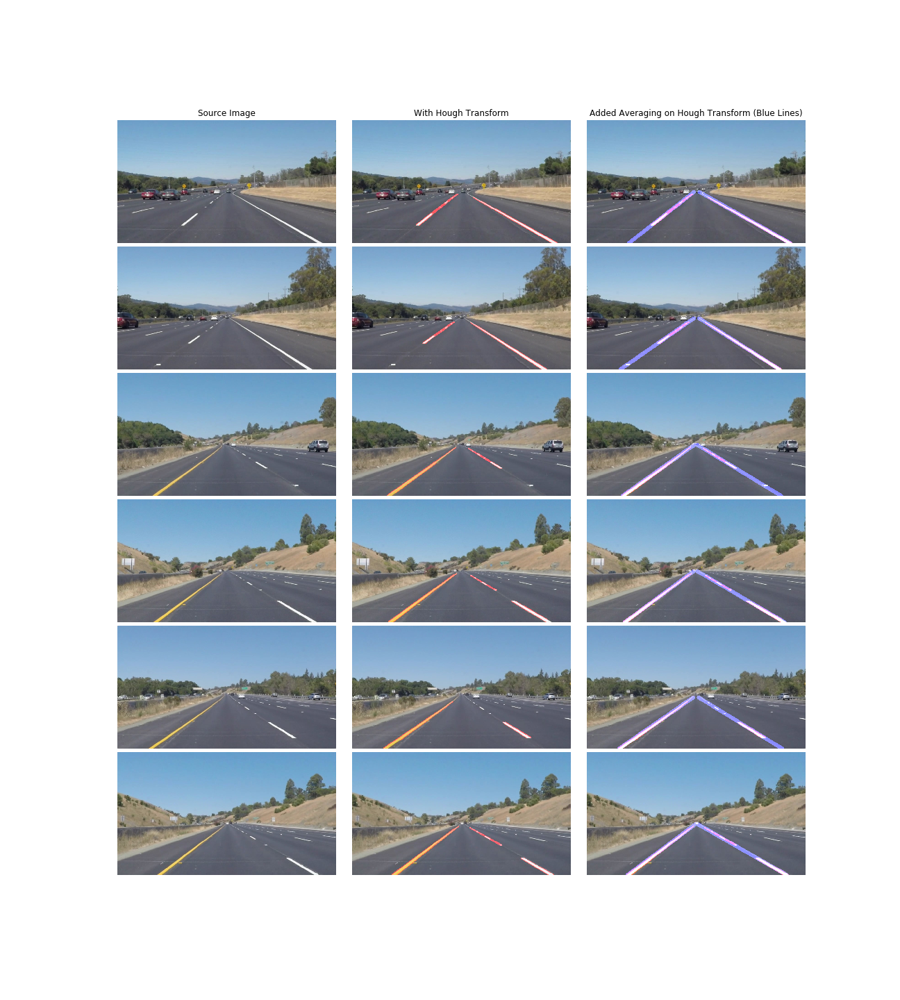
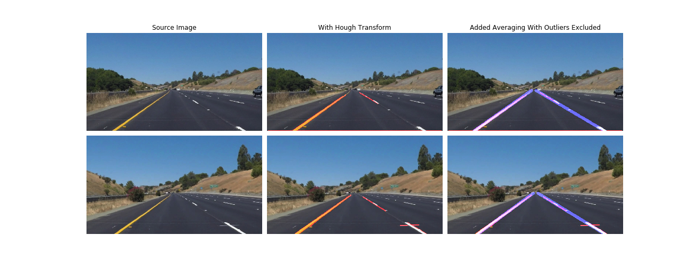

## Project: Finding Lane Lines on the Road** 

Overview - Udacity Self Driving Car Term 1 Project 1
----------------------------------------------------

When we drive, we use our eyes to decide where to go. The lines on the road that show us where the lanes are act as our constant reference for where to steer the vehicle.  Naturally, one of the first things we would like to do in developing a self-driving car is to automatically detect lane lines using an algorithm.

In this project we will detect lane lines in images using Python and OpenCV.  

[image1]: ./examples/grayscale.jpg "Grayscale"

**Finding Lane Lines on the Road**

The goals / steps of this project are the following:
* Make a pipeline that finds lane lines on the road
* Reflect on your work in a written report

### Reflection

### 1. Describe your pipeline. As part of the description, explain how you modified the draw_lines() function.

As a first attempt we created a pipeline of transforms that uses an image of the road from the drivers perspective as input. It applies the following transforms to the image (detailed explanation after the images)
 
  greyscale -> gaussian blur -> canny edge detector -> select region of interest -> hough transform
  
The transformed image is then superimposed onto the original image to generate the output that shows the road lines were identified by the system. Here are some examples

  
  
1. Greyscale- Color information does not add any value for the white / yellow lines in the source images
2. Gaussian Blur- This removes any minor contrasts in adjoining areas and leaves areas where the contrast between adjacent pixels is high (like in road lines)
3. Canny edge detector- Finds edges in the image
4. Select region of interest- We find artifacts with edges all over the image. This reduces the scope of interest to area in front of the vehicle where the road lines are 
5. Hough transform- Finds segments of lines in the region of interest in the image

Running the pipeline on videos we get decent results

Video: [White Line on the Right](test_videos_output/solidWhiteRight.mp4)

Video: [Yellow Line on the Left](test_videos_output/solidYellowLeft.mp4)  

This looks pretty good, it would be great if we could have lines with a fixed length that are longer and are more consistent than in these videos.

In order to achieve this we add averaging of line segments (for the left line and right line separately).
Given n line segments we can compute their average slope and their average center, now we can draw a line with this slope passing from a point at the bottom of the image (where the view begins) to the middle of the image (where the parallel lines converge). This results in a good solution.
  

Running this on the video we get

Video: [Yellow Line on the Left with Averaging](test_videos_output/solidYellowLeftAveraged.mp4)  

Pretty Good!

### 2. Identify potential shortcomings with your current pipeline

We notice two areas of concern

1. Lines sometimes jump around
2. There are times that the lines disappear

Let us solve the first problem. We extract a few problems frames from the video and run our pipeline on them.

  

The two images have line segments (image1- at the bottom of the image a red line running horizontally, Image2- The right line at the bottom has a small red segment) that are included in the left line while computing the average.  

Before we compute the average of segments we can remove any outliers. Outlier segments can be defined as those which have a slope which is quite different from the other slopes of the segments. Making these improvements we get a better result

Running this improved pipeline we get a better video result as one would expect

Video: [Yellow Line on the Leff Exluding Outliera](test_videos_output/solidYellowLeftAveragedNoOutliers.mp4)  

### 3. Suggest possible improvements to your pipeline

We still have some time where the lines disappear. This can be solved by using a weighted sum of the lines already shown where the weights fade off as time passes.

We could also have improvements by defining a range for the potential angles these lines can take, this would exclude any artifacts, shadows or other road markings. 

